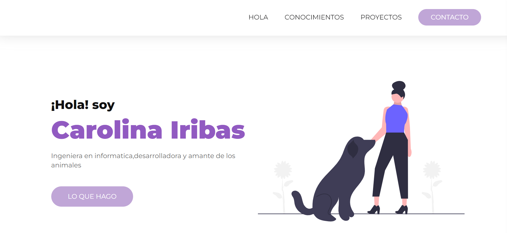

# Portfolio de Carolina Iribas

¡Bienvenido a mi portfolio! Este proyecto es un sitio web personal que muestra mi experiencia, habilidades y proyectos como desarrolladora FrontEnd.

## Tecnologías Utilizadas

- HTML5
- CSS3
- Git

## Secciones del Proyecto

1. Home/sobre mi: Una breve introducción sobre mí y un enlace rápido a otras secciones.
2. Mis Conocimientos: Muestra una lista de mis habilidades y tecnologías que manejo.
4. Portfolio: Galería de proyectos destacados.
5. Contacto: Formulario de contacto y enlaces a mis redes sociales.

## Capturas de Pantalla

![image]

## Despliegue

Puedes ver este proyecto en https://ciribas.github.io/PorfolioCiribas/

## Contacto 

Si tienes preguntas o sugerencias, ¡no dudes en contactarme!

- LinkedIn: [Carolina Iribas](https://www.linkedin.com/in/carolina-iribas/)
- Twitter: [@ciribas](https://twitter.com/ciribas)
- Correo Electrónico: [CarolinaIribas@gmail.com](mailto:CarolinaIribas@gmail.com)

---

Hecho con ❤️ por Carolina Iribas
